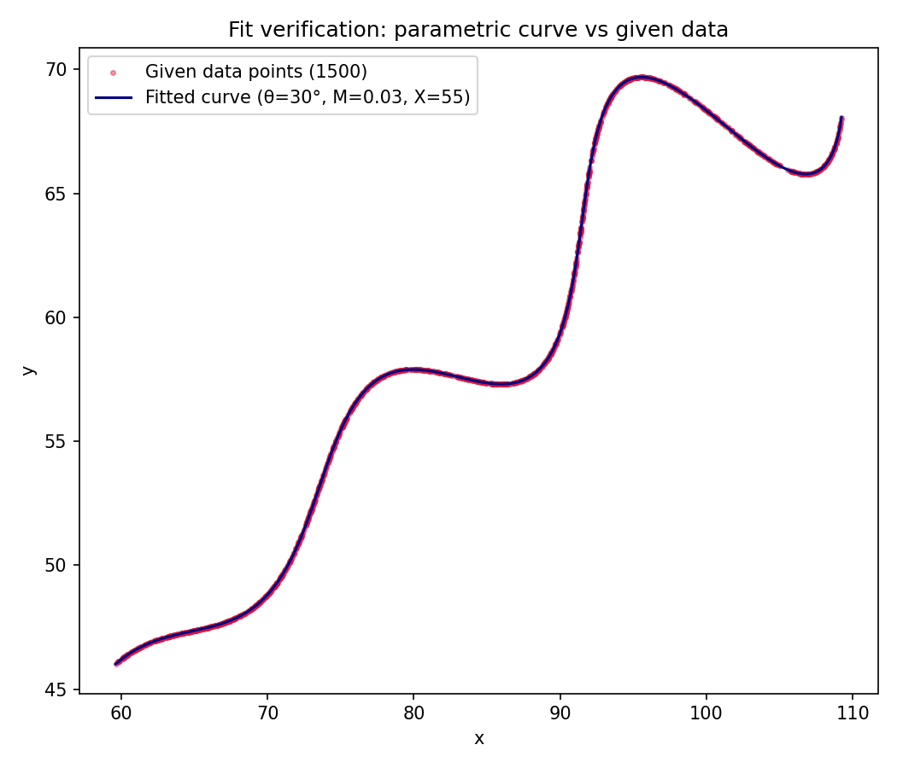
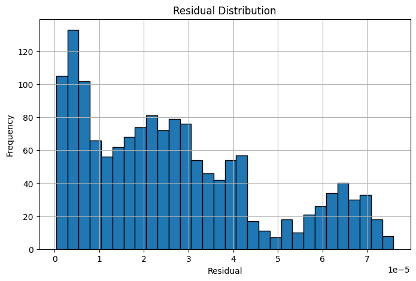

# AI R&D Assignment

# Inverse Estimation of Parametric Curve Parameters

---

## Problem Statement

The objective of this assignment is to recover the unknown parameters

- θ
- M
- X

from a given set of 1500 observed points sampled from the parametric curve

$$
x(t)=t\cos(\theta)-e^{M|t|}\sin(0.3t)\sin(\theta)+X
$$

$$
y(t)=42+t\sin(\theta)+e^{M|t|}\sin(0.3t)\cos(\theta)
$$

subject to

$$
0^\circ<\theta<50^\circ
$$

$$
-0.05<M<0.05
$$

$$
0<X<100
$$

$$
6<t<60
$$

---

## Mathematical Formulation

This problem is formulated as an inverse parameter estimation task.

Given observed points

$$
(x_i,y_i)
$$

the objective is to estimate

$$
\Theta=(\theta,M,X)
$$

such that the generated parametric curve reproduces the observed point cloud.

Since the parameter value associated with each sample is unknown, the problem is treated as a point-cloud-to-curve fitting problem rather than a conventional regression task.

---

## Optimization Strategy

A two-stage optimization framework was employed.

### Stage 1 : Global Search

Differential Evolution was used to estimate

- θ
- M
- X

within the specified parameter bounds.

For every candidate parameter set, the parametric curve was densely sampled over

$$
6\le t\le60
$$

and represented as a point cloud.

---

### Stage 2 : KDTree Matching

A KDTree was constructed from the sampled curve points.

Nearest-neighbour matching was performed between the observed dataset and the candidate curve.

The objective function minimized the cumulative nearest-neighbour distance.

---

### Stage 3 : Residual Refinement

Each sample point was locally refined using bounded optimization to obtain sub-grid precision.

This refinement significantly reduced the reconstruction error.

---

## Estimated Parameters

| Parameter | Estimated Value |
|-----------|-----------------| 
| θ | 30° |
| θ (radians) | 0.5235987756 |
| M | 0.03 |
| X | 55 |

---
## Final Parametric Equation

```text
x(t) = t*cos(0.5235987756)
       - exp(0.03|t|)sin(0.3t)sin(0.5235987756)
       + 55

y(t) = 42
       + t*sin(0.5235987756)
       + exp(0.03|t|)sin(0.3t)cos(0.5235987756)

Domain:
6 ≤ t ≤ 60
```

## Desmos Expression

```text
(t*cos(0.5235987756)-e^{0.03*|t|}*sin(0.3t)*sin(0.5235987756)+55,
42+t*sin(0.5235987756)+e^{0.03*|t|}*sin(0.3t)*cos(0.5235987756))
```

---

## Results

Mean residual distance

```text
2.7×10⁻⁵
```

Maximum residual distance

```text
7.6×10⁻⁵
```

The recovered parameters reproduce the observed dataset with negligible error, indicating an essentially exact reconstruction.

---

## Repository Structure

```text
AI-RnD-Curve-Parameter-Estimation/

│── AI_RnD_Curve_Parameter_Estimation.ipynb

│── README.md

│── fit_verification.png

│── residual_distribution.png

│── xy_data.csv

│── requirements.txt
```

---

## Visual Verification

### Fitted Curve vs Observed Data



### Residual Distribution



---

## Technologies Used

- NumPy
- Pandas
- SciPy
- Matplotlib
- KDTree
- Differential Evolution
- Nonlinear Optimization

---

## References

SciPy Documentation

Differential Evolution Algorithm

KDTree Documentation

Desmos Parametric Graphing

---

## Conclusion

The inverse parameter estimation problem was successfully solved using Differential Evolution combined with nearest-neighbour matching.

The recovered parameters

$$
\theta = 30^\circ
$$

$$
M = 0.03
$$

$$
X = 55
$$

reproduce the provided dataset with negligible residual error.

This strongly suggests that the recovered parameters correspond to the original values used to generate the assignment dataset.
